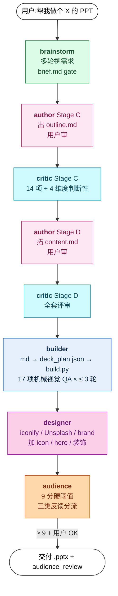

# iLovePPT

> Claude Code 多 agent 流水线,把一句话需求变成 BCG 咨询稿质感的 `.pptx`。

[](https://github.com/pcliangx/iLovePPT/releases/latest)
[](https://github.com/pcliangx/iLovePPT/stargazers)
[](https://github.com/pcliangx/iLovePPT/commits/main)
[](#)
[](https://www.python.org/)
[](LICENSE)

[](https://claude.com/claude-code)
[](https://en.wikipedia.org/wiki/Pyramid_principle)
[-FBCFE8)](library/visual-patterns/README.md)

让 LLM 一次性出完整 .pptx,通常是"看着像但读起来空、视觉糙、论据弱"。**iLovePPT 把"写 PPT"拆成 6 专业 agent + 1 旁路接力流水线**:brainstorm 收需求 → author 出稿 → critic 评审 → builder 构建 → designer 加视觉 → audience 评分,四重 markdown 接缝 + 双闸门质量门(critic 14 项 + audience 9 分硬阈值),内容遵循麦肯锡金字塔原理,视觉对标 BCG/McKinsey。

---

## Quick Start

```bash
git clone https://github.com/pcliangx/iLovePPT.git
cd iLovePPT
bash skills/pptx/scripts/check_deps.sh                                    # 检查依赖
python3 skills/pptx-deck/build.py skills/pptx-deck/examples/demo_plan.json   # → demo .pptx + PNG
```

依赖:`python-pptx` / `lxml` / LibreOffice / poppler / Microsoft YaHei(macOS 需手动装)。

## Agent 用法

把仓库的 `.claude/agents/` 链接到你目标项目的 `.claude/agents/` 下(或直接在仓库内用),然后在 Claude Code 里说一句话:

```
帮我做个 Claude Code 培训的 PPT,15 分钟,技术受众
```

主线程自动派发 6 agent 接力,从需求挖掘到 .pptx 交付:



详细操作手册见 [docs/MANUAL.zh.md](docs/MANUAL.zh.md)。

## 文档地图

| 文档 | 给谁看 |
|---|---|
| [docs/MANUAL.zh.md](docs/MANUAL.zh.md) | **用户** — 怎么对话、审稿、收稿 |
| [docs/agent-internals.zh.md](docs/agent-internals.zh.md) | **改造者** — 流水线架构 + agent 职责 + 4 协作机制 + 6 设计决策 |
| [.claude/pipeline-protocol.md](.claude/pipeline-protocol.md) | **Claude Code 主线程 AI** — 派发顺序 / handoff / gate 权威活协议 |
| [CLAUDE.md](CLAUDE.md) | **Claude Code** — 仓库导航 + 不变式 + 约定 |
| [library/visual-patterns/README.md](library/visual-patterns/README.md) | Visual Patterns RAG(hosted multimodal,text/image/hybrid 3 mode) |

## License

[MIT](LICENSE) · © 2026 pcliangx
