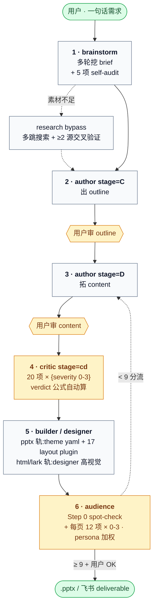

# iLovePPT

> Claude Code 多 agent 流水线,把一句话需求变成 BCG 咨询稿质感的 `.pptx`。

[](https://github.com/pcliangx/iLovePPT/releases/latest)
[](https://github.com/pcliangx/iLovePPT/stargazers)
[](https://github.com/pcliangx/iLovePPT/commits/main)
[](#development)
[](https://www.python.org/)
[](LICENSE)

[](https://claude.com/claude-code)
[](https://en.wikipedia.org/wiki/Pyramid_principle)

让 LLM 一次性出完整 .pptx 通常是"看着像但读起来空、视觉糙、论据弱"。**iLovePPT 把"写 PPT"拆成 7 步 agent 流水线 + 4 道质量 gate**:brainstorm 收 brief(自带 5 项 self-audit)→ author 出 outline → author 拓 content → critic stage=cd 合审(**20 项量化 rubric** · verdict 公式自动算,LLM 不主观判)→ builder 构建 + 主动加视觉 → audience 模拟目标受众评分(每页 **12 项 × 0-3 分** · describe-then-score 两跳 · 9 分硬阈值)。**评审是量化的、可回归的**:每项强制 `{passed, evidence 引原文, severity 0-3, suggestion}`,SubagentStop hook 按公式重算 verdict 防篡改。**机械 gate 贯穿产物**:EA 字体读侧全量审计、XML 级几何审计(越界 / 文字重叠 / 跨页对齐)、layout 三层可渲染性校验、红线词 5 道防线、`content.md` 单源 sha256 verify。**4-track 输出**:默认 pptx 轨(17 layout plugin + yaml theme token),高视觉 html 轨(CSS 全量表达力 → html2pptx 转原生 .pptx),以及飞书 lark-slides / lark-whiteboard 双轨。

---

## Quick Start

```bash
# 1. clone + 装依赖
git clone https://github.com/pcliangx/iLovePPT.git
cd iLovePPT
pip install -e ".[diagram,dev]"

# 2. 检查外部依赖(LibreOffice / poppler / Microsoft YaHei)
bash .claude/skills/pptx/scripts/check_deps.sh

# 3.(推荐)启用 .githooks · pre-commit 扫敏感数据 / 防误提
bash scripts/install-hooks.sh

# 4.(可选)跑 demo 验证安装
python3 .claude/skills/pptx-deck/build.py .claude/skills/pptx-deck/examples/demo_plan.json

# 5. 在仓库根目录打开 Claude Code,跟主线程说一句话:
#    "帮我做个 Claude Code 培训的 PPT,15 分钟,技术受众"
#    主线程自动派 5 agent 接力(brainstorm → author×2 → critic cd → builder → audience),
#    产出在 decks/<slug>/builder/deck_v1.pptx
```

依赖:`python-pptx` / `lxml` / `pyyaml` / LibreOffice / poppler / Microsoft YaHei(macOS 需手动装,Linux 通常自带)。html 高视觉轨额外需要 Node.js + Playwright(Chrome)。

---

## Architecture Overview

### 7-step pipeline · 4 quality gates



- **5 主流水线 agent**(全 opus):`iloveppt-brainstorm` / `iloveppt-author` / `iloveppt-critic` / `iloveppt-builder` / `iloveppt-audience`
- **2 旁路 agent**:`iloveppt-designer`(html / lark 高视觉轨,与 builder 平级)· `iloveppt-research`(素材不足时补给,claims 带 source URL 接进保真 gate)
- **1 helper agent**(Haiku 省 token):`iloveppt-yaml-fixer`(主线程工程错误恢复时派)
- **User checkpoint**:3 道(brief / outline / content) + 收口 1 道(deliverable OK)
- **Hot-reload rework**:`chapter_hashes` 增量重算,只跑 changed chapter,不全 deck 重跑

### 4-track 输出

| track | 产出 | 定位 |
|---|---|---|
| `pptx`(默认) | 原生 `.pptx`(theme yaml token + 17 layout plugin) | 数据密集 / 内部汇报 |
| `html` | 高视觉 `.pptx`(CSS 全量表达力 → vendored html2pptx 逐元素转原生对象) | 品牌 pitch / 对外路演 |
| `lark-slides` | 飞书演示文稿 | 飞书协作主力 |
| `lark-whiteboard` | 飞书 doc(N 白板) | 海报式 / 自由画布 |

四轨共享 content.md(内容 SSOT)与 theme yaml(视觉 SSOT,html/svg 轨经 `theme2css.py` 派生 CSS vars),最终都收敛到 `builder/deck_v{N}_render/page-*.jpg` —— audience 评分 track-agnostic。

### 3-skill 分层

```
pptx-deck   ── 编排者 · brief.md → outline.md → content.md → deck_plan.json → 完整 .pptx
   ├── 调用 → pptx     (helpers / layout plugin / office 脚本 / render 流水线)
   └── 调用 → diagram  (draw.io / mermaid / matplotlib → PNG)
pptx        ── 底层 .pptx 读写 · 17 layout plugin auto-discover · 也可独立使用
diagram     ── 图表生成 · draw.io 首选 · 也可独立使用
```

### Theme:yaml token SSOT + 三层 layout 分发

- **theme = 纯 yaml token**(`.claude/skills/pptx-deck/themes/<name>.yaml`):色板 / 字体 / `mode`(light|dark)/ `style` 风格配方(sharp / soft / rounded / pill)。内置 `tech_blue`(BCG 深蓝)/ `template_golden`(黄金商务)/ `template_training`(培训橙红);改色改字体**只改 yaml**
- **layout 三层分发**(`builder/tier2.py`):theme yaml `layouts:` mapping(含 alias)→ theme module `make_<layout>` → `helpers/<layout>.py` LayoutRegistry plugin 标准实现。**17 enum layout 任一 theme 下都可渲染**,三层全 miss 才 fail-loud
- **用户自有 .pptx 模板**:对话里给路径,`load_theme(<path>.pptx)` 自动提取主色 / 字体 / 字号阶梯作临时 theme

### 受控词典(`library/vocabularies/`)

| SSOT | 容量 | 消费方 |
|---|---|---|
| `layout_variants.yaml` | 139 enum | author 选 layout 写 `<!-- layout: X -->`;`derive_plan.py --strict` 三层解析预拦自造名 |
| `audience_personas.yaml` | 7 persona | brainstorm 收 brief + audience 按 persona 加权评分(未知 key fail-loud) |
| `keywords_bank.yaml` | 13 桶 / ~340 词 | research agent 扩展搜索词 |

### Deck skeletons(`library/deck-skeletons/`)

6 类常见 deck 预置骨架(brief 字段建议 + outline 模板 + 默认 SCQA):`quarterly_finance_report` · `annual_strategy_review` · `product_launch` · `team_okr_kickoff` · `project_postmortem` · `customer_pitch`。给 brainstorm 省 30-50% 来回。

详细架构 + 派发 / handoff / gate 协议见 [`.claude/pipeline-protocol.md`](.claude/pipeline-protocol.md) 与 [`docs/agent-internals.zh.md`](docs/agent-internals.zh.md)。

---

## User Workflows

### A. 标准 deck —— 一句话起 deck

最简单的用法:在仓库根目录跟 Claude Code 主线程说一句话,7 步流水线自动跑完。

```
用户:做 PPT,主题是 "Claude Code 培训",15 分钟,技术受众
主线程:好的,我先派 brainstorm 跟你确认需求...
   → brainstorm 多轮挖 brief
   → 用户审 brief.md ✓
   → author Stage C 出 outline.md
   → 用户审 outline.md ✓
   → author Stage D 拓 content.md
   → 用户审 content.md ✓
   → critic 量化评审 20 项 → pass
   → builder 构建 .pptx + 机械审计(EA 字体 / 几何)+ 视觉 QA + 主动加视觉
   → audience 模拟受众读 → overall_score 9.2 ≥ 9
   → 交付 decks/claude-code-training/builder/deck_v1.pptx
```

### B. Skeleton —— 用预置骨架起 deck

```bash
# 列出可用 skeleton
ls library/deck-skeletons/

# 用 quarterly_finance_report 起新 deck
scripts/new_deck.py 2026-q2-report --skeleton quarterly_finance_report

# 然后跟主线程说"基于 decks/2026-q2-report 的 skeleton 做 PPT",
# brainstorm 跳过空白对话,直接基于 skeleton 进入填字段阶段
```

详见 [`library/deck-skeletons/README.md`](library/deck-skeletons/README.md)。

### C. 跨 deck 复用章节

```bash
# 把 deck A 的第 5 章 append 到 deck B 末尾 · layout 注释 + 引用图片自动 cp
scripts/clip_chapter.py decks/A/author/deck_v1_content.md --chapter 5 \
                        --target decks/B/author/deck_v1_content.md
```

### D. 用自己的品牌模板

对话里直接给 .pptx 路径:

```
用户:这是我们的品牌模板,按它的配色做 → /path/to/brand_master.pptx
```

brief.theme 填该路径,builder 经 `load_theme()` 自动提取主色(accent1-6)/ 字体(master EA)/ 字号阶梯作临时 theme;要长期复用则参考 [`docs/writing-custom-themes.md`](docs/writing-custom-themes.md) 落一份 `themes/<name>.yaml`。

### E. 跨 deck dashboard

```bash
# token cost / rework rate / audience 失败 layout / ...
scripts/dashboard.py
```

---

## Capabilities

### 质量 gate 一览

| gate | 位置 | 机械程度 |
|---|---|---|
| brief self-audit 5 项 | brainstorm Step 3.6 | 半机械(enum / 存在性可验,张力靠 LLM) |
| critic 20 项量化 rubric | stage=cd 合审 | severity 由 LLM 给,verdict 公式自动算 + hook 重算防篡改;SSOT `critic-rubric.yaml`(全仓 yaml parse gate 防损坏) |
| layout 可渲染性 | `derive_plan.py --strict` + builder tier3 | 全机械(三层解析) |
| deck_plan sha256 verify | builder Step 0.5 | 全机械(content.md 单源) |
| EA 字体审计 | builder Step 2.9 / designer Step 2.9(html 轨 + `fix_ea_fonts.py` 产物端修复) | 全机械(读侧全量,exit gate) |
| 几何审计 | builder Step 3.0(`audit_pptx.py --sections geometry`) | 全机械(越界 / 文字重叠 / 跨页标题一致,advisory) |
| 视觉 QA 17 项 checklist | builder Step 3(LLM 读渲染 JPG) | LLM 人审(机械查不了的:配色观感 / 留白 / 反 AI 痕迹) |
| audience spot-check 5 项 | audience Step 0 | 机械为主(placeholder grep / 图源配对 / PNG 破损 / 红线词 / claims 保真) |
| audience 12 项 × persona | audience 主评 | describe-then-score 两跳 + persona 权重 + multi-persona 取 min |
| 红线词 | author 自检 → critic B9 → build.py → audience ×2 | 全机械(5 道 grep 防线) |

### 工程能力一览

| 能力 | 说明 |
|---|---|
| **Per-deck cost budget** | brief 设上限 · 50% / 80% / 100% stderr warn · 超额暂停问用户 · [`docs/cost-budget.md`](docs/cost-budget.md) |
| **chapter_hashes hot-reload** | rework 只重算 changed chapter · 不全 deck 重跑(rework 时间 -60%) |
| **读侧 .pptx 机械审计** | `scripts/audit_pptx.py` · fonts(EA gate)/ geometry / shapes / hyperlinks / embedded / MSIP |
| **EA 字体产物端修复** | `scripts/fix_ea_fonts.py` · html 轨 latin-only run 补 `<a:ea>`+`<a:cs>` · 幂等 + 自动备份 |
| **claim 级源数据保真** | `scripts/check_source_fidelity.py` · author 自检 + audience 复核 · research claims 带 source URL 接入 |
| **Theme yaml 化** | `themes/<name>.yaml` 数据驱动(色板 / 字体 / mode / style 配方) · [`docs/writing-custom-themes.md`](docs/writing-custom-themes.md) |
| **Layout plugin auto-discover** | `helpers/<layout>.py` 自动发现 · 17 enum 全覆盖 · 不动 `__init__.py` · [`docs/adding-new-layout.md`](docs/adding-new-layout.md) |
| **html2pptx 高视觉轨** | vendored(Playwright 真实渲染 → 逐元素转原生 pptx 对象;渐变 / 阴影 / 圆角光栅化保真) |
| **t2i 文生图** | `scripts/t2i.py` · designer cover/hero · OpenAI-compatible · 自动写 source.yaml 可复现 |
| **图片资产 reproducibility** | 生成 / 下载 / 引用类图片强制配对源文件或 source.yaml,缺 source 视为 bug |
| **中英文混排渲染** | `mixed_lang_text(runs)` + `tokenize_mixed` · 解 EA / latin 字段冲突 |
| **pre-commit hook 扫敏感** | `_assets/raw` 误提强警告 · [`docs/security/secrets-protection.md`](docs/security/secrets-protection.md) |
| **scripts/dashboard.py** | 跨 deck 聚合 token / rework / audience / layout failure rate |
| **scripts/deck_diff.py** | 跨 deck content.md 语义 diff |
| **scripts/derive_plan.py** | `content.md` 单源 auto-derive · `--strict` layout 预拦 |

---

## Documentation Map

| 文档 | 给谁看 |
|---|---|
| [docs/agent-internals.zh.md](docs/agent-internals.zh.md) | **改造者** — 流水线架构 + agent 职责 + 协作机制 + 设计决策 |
| [docs/cost-budget.md](docs/cost-budget.md) | per-deck cost / budget 上限 / 超额处理 |
| [docs/writing-custom-themes.md](docs/writing-custom-themes.md) | 写自定义 theme(yaml token) |
| [docs/adding-new-layout.md](docs/adding-new-layout.md) | 加 layout plugin(`helpers/<name>.py`) |
| [docs/security/secrets-protection.md](docs/security/secrets-protection.md) | pre-commit hook / 敏感数据防护 |
| [docs/security/api-key-rotation.md](docs/security/api-key-rotation.md) | API key 轮换 |
| [.claude/pipeline-protocol.md](.claude/pipeline-protocol.md) | **Claude Code 主线程 AI** — 派发 / handoff / gate 权威活协议 |
| [CLAUDE.md](CLAUDE.md) | **Claude Code** — 仓库导航 + 不变量 + 约定 |
| [library/deck-skeletons/README.md](library/deck-skeletons/README.md) | Deck Skeletons SSOT(6 类型骨架) |

---

## Development

改造者 / 贡献者命令(`pyproject.toml` 已配 `pythonpath`,无需 `sys.path` hack):

```bash
# 跑全部测试
python3 -m pytest tests/ -q                              # 应全绿(结构断言,不验视觉)

# 跑单测
python3 -m pytest tests/pptx/test_helpers.py::test_set_font_writes_ea_typeface -v

# 启用 .githooks(pre-commit 扫敏感 / 防误提)
bash scripts/install-hooks.sh

# 跨 deck dashboard(token / rework / audience / layout failure rate)
python3 scripts/dashboard.py

# `.gitignore` 一致性 lint
python3 scripts/gitignore_lint.py

# skill 独立烟测(不走 agent)
python3 .claude/skills/pptx/examples/minimal_deck.py     # → /tmp/iloveppt_minimal.pptx
bash .claude/skills/diagram/examples/render.sh           # → diagram examples/minimal.png

# 渲染 .pptx 视觉验证(测试只验结构,改 layout/helper 后必须渲染人审)
soffice --headless --convert-to pdf <file>.pptx --outdir /tmp/
pdftoppm -jpeg -r 120 /tmp/<file>.pdf /tmp/slide

# 读侧机械审计(EA 字体 + 几何)
python3 scripts/audit_pptx.py <file>.pptx --sections fonts,geometry --format text

# 检查外部依赖
bash .claude/skills/pptx/scripts/check_deps.sh

# 端到端绕过 agent(已有 deck_plan.json 时)
python3 .claude/skills/pptx-deck/build.py <path> [--no-render]
```

无 build 步骤、无 linter 配置(`gitignore_lint.py` 例外)。CI(GitHub Actions):pytest 全量 + 品牌词扫描 + 密钥扫描 + gitignore lint。

---

## FAQ / Troubleshooting

**Q: 怎么自定义 theme?**
A: 写 `.claude/skills/pptx-deck/themes/<your_name>.yaml`(数据驱动 tokens · 色 / 字 / mode / style 配方) + 可选 `<your_name>.py`(只放无法 yaml 描述的特殊 layout 逻辑;缺的 layout 由 helpers plugin 兜底)。完整流程见 [`docs/writing-custom-themes.md`](docs/writing-custom-themes.md)。

**Q: 怎么加新 layout?**
A: 写 `.claude/skills/pptx/helpers/<layout>.py` — 一个文件,自动 discover,不动 `__init__.py` / `build.py` / `themes/`。完整模板见 [`docs/adding-new-layout.md`](docs/adding-new-layout.md)。

**Q: deck 跑多少钱?**
A: 每个 deck 的 `state.json` 自动记 `cost.tokens_by_agent` + `cost.cost_usd`。brief 阶段可设 `cost_budget_usd`(默认 10),跨 50% / 80% / 100% stderr warn,超额暂停。详见 [`docs/cost-budget.md`](docs/cost-budget.md)。

**Q: 用自己的品牌模板?**
A: 对话里给 .pptx 路径,builder `load_theme()` 自动提取主色 / 字体 / 字号阶梯;长期复用落一份 `themes/<name>.yaml`(见 Workflow D)。

**Q: rework 一章会重跑整 deck 吗?**
A: 不会。`chapter_hashes` 增量重算,只跑 changed chapter,rework 时间 ~ -60%。

**Q: critic / audience 评分稳定吗?**
A: critic 20 项 × {evidence, severity 0-3, suggestion} 结构化 schema · verdict 公式自动算 + SubagentStop hook 重算复核 · audience 每页 12 项 × 0-3 describe-then-score,跑 3 次方差 < 0.5。详见 `.claude/agents/critic-rubric.yaml`。

**Q: 跑出来字渲染破?**
A: macOS / Linux 需手动装 Microsoft YaHei(项目默认中文字体)。`bash .claude/skills/pptx/scripts/check_deps.sh` 自动检测。html 轨产物可用 `scripts/fix_ea_fonts.py` 修复 latin-only run。设计决策 + EA / latin 字段处理见 [`CLAUDE.md`](CLAUDE.md) "关键不变量"。

---

## License

[MIT](LICENSE) · © 2026 pcliangx
