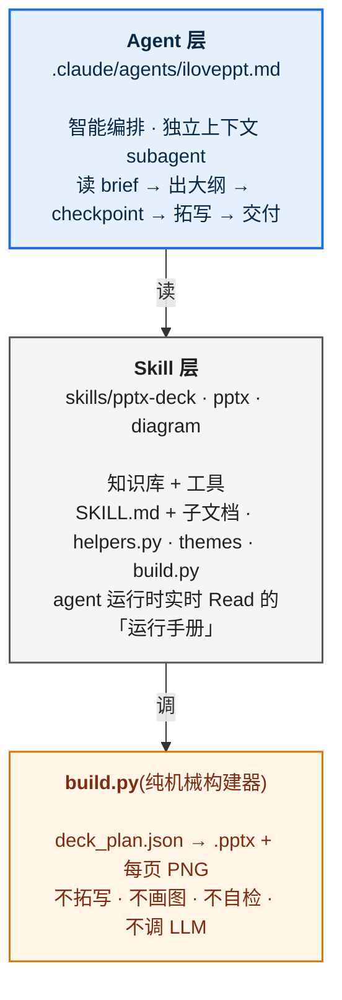
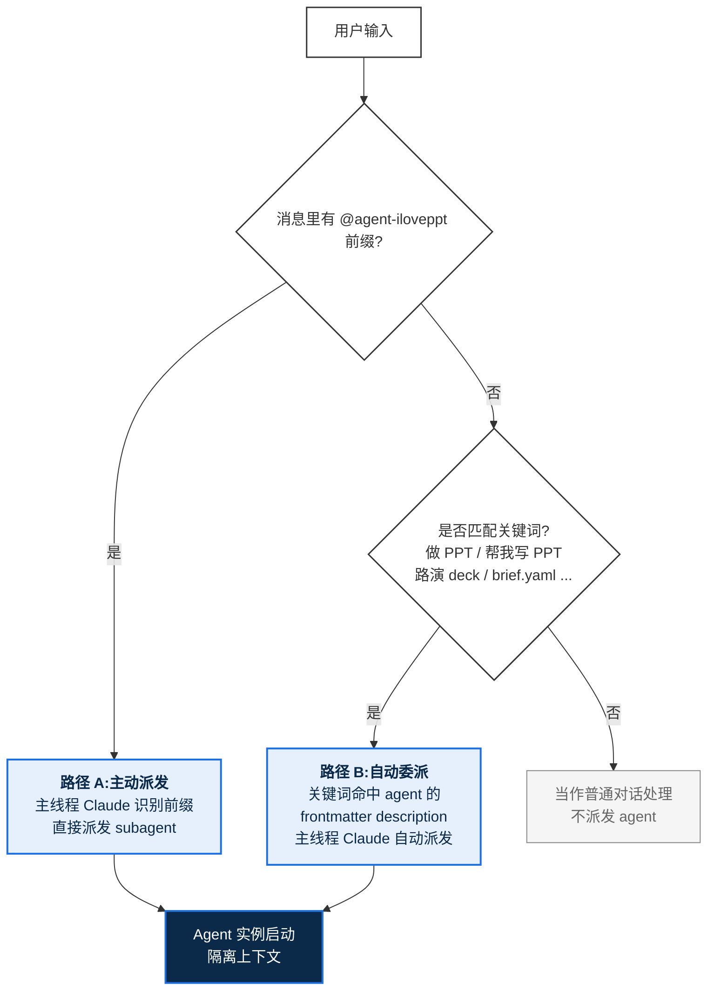
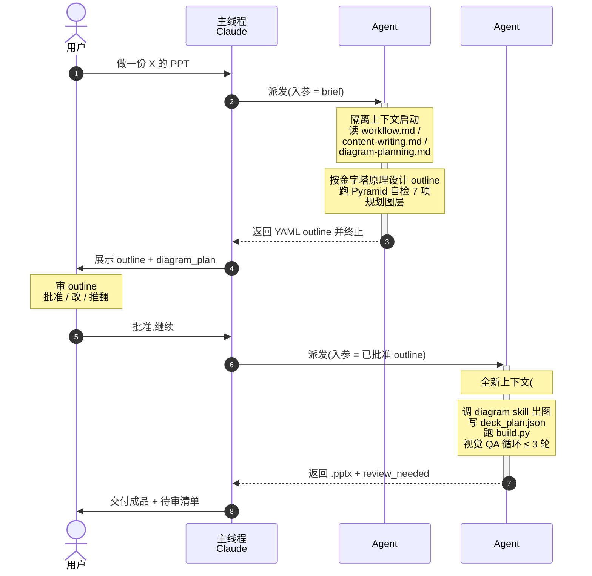
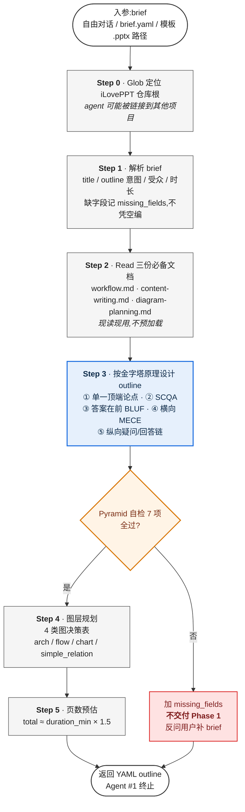
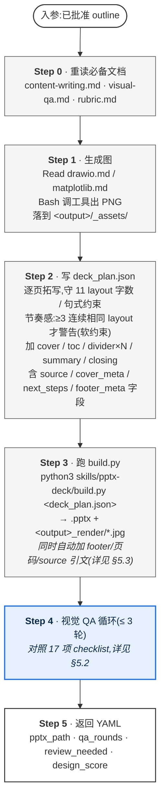
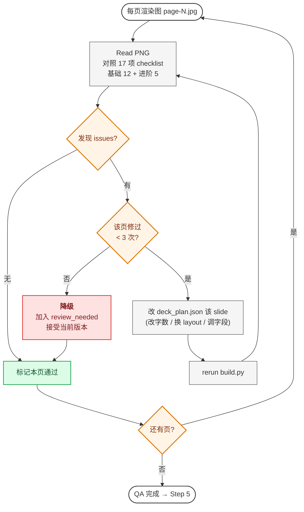
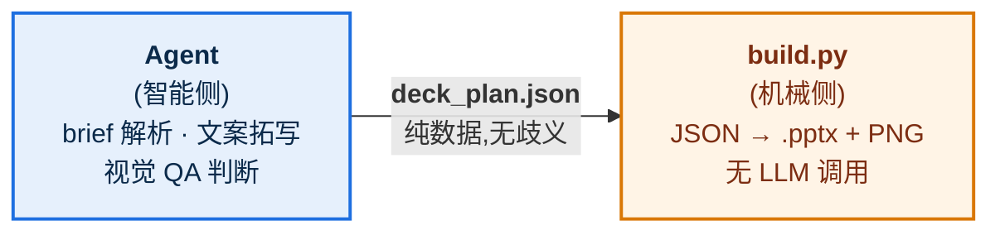

# iLovePPT Agent 工作原理

> 这份文档讲清楚 iLovePPT agent **怎么工作的**——架构、触发机制、两阶段流程、关键设计决策。
> 适合想理解(或后续改造)agent 行为的人;不是用户操作手册(那个看 [`MANUAL.zh.md`](MANUAL.zh.md))。

---

## 目录

- [1. 三层架构:agent / skill / build.py 各自的角色](#1-三层架构agent--skill--buildpy-各自的角色)
- [2. 触发机制:agent 怎么被唤起](#2-触发机制agent-怎么被唤起)
- [3. 两阶段派发模型 —— 设计的灵魂](#3-两阶段派发模型--设计的灵魂)
- [4. Phase 1 详解:大纲是怎么出来的](#4-phase-1-详解大纲是怎么出来的)
- [5. Phase 2 详解:构建到交付](#5-phase-2-详解构建到交付)
- [6. 关键设计决策:为什么这么设计](#6-关键设计决策为什么这么设计)
- [7. 一次完整调用的 timeline 示例](#7-一次完整调用的-timeline-示例)
- [8. 这套设计避开了哪些常见坑](#8-这套设计避开了哪些常见坑)
- [9. 进一步阅读](#9-进一步阅读)

---

## 1. 三层架构:agent / skill / build.py 各自的角色

iLovePPT 不是单一组件,而是 3 层叠加:



**关键认知**:agent 是"会思考的人",build.py 是"会按图纸施工的木工",skill 是"摆在工地上随时翻的施工手册 + 工具箱"。

---

## 2. 触发机制:agent 怎么被唤起

你在 Claude Code 里有两种入口:



agent 的 frontmatter 决定它能不能被自动委派:

```yaml
---
name: iloveppt
description: 端到端 PPT 生成 agent... Use proactively when the user wants
             a deck/presentation/PPT generated from a topic or brief ——
             做 PPT / 帮我写 PPT / 路演 deck / 汇报 / 提案 / brief.yaml / .pptx 模板。
tools: Bash, Read, Write, Edit, Glob, Grep, Skill
model: opus
---
```

- `description` 是触发关键词的家——主线程 Claude 看这里决定要不要委派
- `tools` 限定 agent 能用什么——它不能再派 subagent(自我嵌套禁止)
- `model: opus` —— 视觉 QA + 内容判断密集,需要判断力

**派发后,subagent 启动一个全新的隔离上下文**——主线程的对话历史它都看不到。所以入参就是它能看到的全部世界。

---

## 3. 两阶段派发模型 —— 设计的灵魂

这是 iLovePPT 最重要的设计决策:**一次任务,两次派发,中间一个人工 checkpoint。**



### 为什么要拆两阶段?

| 不拆 | 拆 |
|---|---|
| agent 一口气跑完,中间不停 | Phase 1 出完大纲就**强制停下** |
| 大纲跑偏要等成品才发现,白干 30 页 | 大纲不对,**checkpoint 处就纠偏**,成本最低 |
| 用户体感是"黑盒拿成品" | 用户体感是"我能介入设计" |

**金字塔原理是核心要求**这件事就是 checkpoint 才能兜住——agent 在 Phase 1 跑 7 项 Pyramid 自检,任一不过 → 列在 `missing_fields`,**不交付**,反问你。

### Agent 自己怎么知道现在跑哪个 Phase?

看派发入参里**有没有"已批准 outline 结构"**:

```python
# agent 内部判断逻辑(伪代码)
if "已批准 outline" in dispatch_input:
    run_phase_2()
else:
    run_phase_1()
```

---

## 4. Phase 1 详解:大纲是怎么出来的



返回的 YAML 是结构化的——主线程 Claude 不需要解析,直接给你看就行。

---

## 5. Phase 2 详解:构建到交付

Phase 2 进来时是**全新上下文**——Phase 1 读过的文档现在它都不记得。所以第 0 步要重读。

### 5.1 Phase 2 主流程



### 5.2 Step 4 视觉 QA 循环细节



### 5.3 Cross-cutting concerns:build.py 在 fn 调用后自动加的东西

`build.py` 调完 `theme.make_<layout>()` 后,**还会自动处理 3 类"横切关注点"** —— theme `make_*` 函数完全不感知,职责干净:

```mermaid
flowchart TB
    F[make_<layout>(prs, **fields) 返回] --> P1{slide 有 source 字段?}
    P1 -->|是| SC[H.source_citation<br/>渲染 'Source: ...' 在 footer 上方<br/>italic / GRAY_500 / 9pt]
    P1 -->|否| P2
    SC --> P2{layout 在 FOOTERED_LAYOUTS?<br/>(8 种内容页,排除 cover/divider/closing)}
    P2 -->|是| FT[H.footer<br/>分隔线 + 'N / TOTAL' 右对齐<br/>+ classification·project·version 左侧<br/>(从 plan.footer_meta 读)]
    P2 -->|否| END([本 slide 完成])
    FT --> END
    classDef io fill:#FFF,stroke:#333,stroke-width:1.5px
    classDef gate fill:#FFF4E6,stroke:#D97706,stroke-width:2px,color:#7C2D12
    classDef act fill:#E6F0FC,stroke:#1E6FE0,stroke-width:2px,color:#0B2A4A
    class F,END io
    class P1,P2 gate
    class SC,FT act
```

**为什么 build.py 集中做,而不是放进每个 `make_*`?**

- theme `make_*` 只关心**布局视觉**(把 title/items 摆好);footer 和 source 是**规范层关注**(每页都要有),不该让每个 layout 函数都重复处理
- 想新增一种 cross-cutting(比如水印 / classification 徽标),改 build.py 一处即可,11 个 layout 一起生效
- agent 写 `deck_plan.json` 时,这些字段是**通用 slot**(任何 layout 都可加 `source`),不需要为每种 layout 各想一遍

---

## 6. 关键设计决策:为什么这么设计

### 6.1 build.py 是"纯机械",智能全在 agent

**问的人最多的问题:为什么 build.py 不内嵌 LLM 调用?**

答:**因为接缝必须诚实。**



- **可重放**:agent 死了,你拿着 `deck_plan.json` 自己 `python3 build.py` 也能出一模一样的 .pptx
- **可调试**:出问题先看 `deck_plan.json` —— 是 agent 没拓写好,还是 build.py 渲染错?一目了然
- **可测试**:`evals/run_eval.sh` 跑固定 deck_plan,验证 build.py 没回归——不掺 LLM 不确定性

如果 build.py 内嵌 LLM 调用,这 3 条全废了。

### 6.2 deck_plan.json 这个"接缝"是设计核心

```json
{
  "theme": "tech_blue",
  "output": "./deck.pptx",
  "footer_meta": {
    "classification": "INTERNAL",
    "project": "Project Atlas",
    "version": "v2.0"
  },
  "slides": [
    {"layout": "cover", "title": "...", "subtitle": "...",
     "prepared_by": "...", "date": "...", "version": "...",
     "project_code": "...", "classification": "INTERNAL"},
    {"layout": "cards", "title": "...", "cards": [{"title":"...","body":"..."}]},
    {"layout": "table", "title": "...", "headers": [...], "rows": [...],
     "source": "Source: 公司财报 2025 Q4"},
    {"layout": "closing", "subtitle": "Q&A",
     "next_steps": [{"action":"...","owner":"Alice","due":"2026-06-15"}]}
  ]
}
```

每个 slide 对象的 schema 由 `layout` 字段决定——这就是 agent 和 build.py 之间的"接口契约"。

11 种 layout 的字段约束写在 `content-writing.md`,agent 拓写时必须遵守。

**两类字段**:

- **layout-specific**:`cards.cards[]` / `table.headers` 等 —— 进 `make_<layout>(**fields)`
- **cross-cutting**:`source`(数据 slide 引文)/ `footer_meta`(顶层,机密/项目/版本)/ cover 的 `prepared_by/date/version/...` / closing 的 `next_steps[]` —— build.py 或对应 make_* 单独处理(详见 §5.3)

### 6.3 Skill docs 是产品,不是文档

`.md` 文档不是"参考材料"——**它们是 agent 在运行时实时 Read 的"运行手册"**。

改 `content-writing.md` 的金字塔自检规则 → agent 下次跑 Phase 1 时就按新规则跑。这就是为什么这些 `.md` 写得像"操作指令"而不是"概念解释"。

### 6.4 视觉 QA 为什么是 Claude 做,不是脚本?

因为视觉问题(文字溢出、字体 fallback、留白失衡、颜色对比度)用 Python 规则识别极其脆弱,而 Claude 多模态读 PNG 直接判断又快又准。

**循环逻辑**:

```
fix → rebuild → recheck → if still bad after 3 rounds → review_needed
```

3 轮上限是**反死循环兜底**——3 轮还修不好,多半是 layout 选错(改字号 / 位置都救不了),降级让人审。

### 6.5 SSOT(单一权威源)防漂移

颜色 / 字体 / 尺寸有且只有一份定义,在 `skills/pptx/helpers.py`:

```python
BRAND_PRIMARY = RGBColor(0x0A, 0x52, 0xBF)   # AAA 7.00:1 对比度(投影必过)
ACCENT        = RGBColor(0x00, 0x7A, 0x6D)   # AA 5.2:1
FONT_CN       = "Microsoft YaHei"            # 系统兼容默认
FONT_CN_DESIGN= "Source Han Sans CN"         # 设计感更强(opt-in)
SLIDE_W       = Inches(13.333)
FOOTER_TOP    = Inches(7.0)
```

所有 theme / helper / build.py 都引用这些常量,不复制。改一处全 deck 生效。

**两条独立 SSOT 链**(2026-05-23 拆分):

- **`helpers.py`** —— `.pptx` 渲染域的字体 / 色 / 尺寸 / 几何常量
- **`skills/diagram/matplotlib_rc.py`** —— matplotlib 数据图域,从 `helpers.py` 抄录 hex 字符串供 matplotlib 用,保证 chart 与 slide 视觉一致(字体 / 配色 / 网格风格)

为什么拆?matplotlib 用 `font.sans-serif` 列表 / hex 字符串,跟 python-pptx 的 `RGBColor` / `<a:ea typeface>` 类型不兼容,无法直接共享对象。所以 matplotlib_rc 是"helpers.py 的派生镜像"——改 helpers 后需手动同步(改色值时 grep `_hex(H.` 找到所有 mirror 点)。

### 6.6 字号 / 色 / 字段都对标 BCG/McKinsey

2026-05-23 全面对标行业最佳实践,17 项调整落地:

| 调整 | 旧 → 新 | 依据 |
|---|---|---|
| body 字号 | 14pt → 18pt | BCG/Beautiful.ai/BrightCarbon 最低投影标准 |
| 页标题 | 28pt → 32pt | MBB action title 标准 |
| BRAND_PRIMARY | `#1E6FE0`(AA) → `#0A52BF`(AAA 7:1) | WebAIM 投影建议 |
| Source 引文 | 无 → 自动加在 footer 上方 | MBB 数据 slide 硬要求 |
| Cover 元数据 | 无 → prepared_by/date/version/project_code/classification | 咨询稿标准 |
| Closing 结构 | "谢谢"+ subtitle → 可选 next_steps 列表 | closing = call to action |
| Footer 左侧 | 仅 page num → +classification·project·version | MBB 标准 footer |
| matplotlib 风格 | 用 default → matplotlib_rc SSOT(BRAND_*  配色 + YaHei) | 防 chart 与 deck 视觉割裂 |
| action title | 无字数上限 → ≤ 24 字硬约束 | 防换行破布局 |
| 12-col grid | 无 → `grid_columns()` 锚定 | 防跨页对不齐 |
| 视觉 QA | 12 项 → 17 项 | + 留白 / 热区 / 主色比例 / 跨页一致 |

完整对标过程见会话历史(执行前做了 web research + 18 项 gap audit)。

---

## 7. 一次完整调用的 timeline 示例

假设你说:`@agent-iloveppt 做一份"评审办法 v1.0"的 PPT,15 分钟,技术受众`

```
T+0s    主线程 Claude 派发 Phase 1
T+2s    Agent #1 启动,读 brief
T+8s    Read workflow.md / content-writing.md / diagram-planning.md
T+15s   设计 outline + 跑 Pyramid 自检
T+20s   规划 diagram_plan(判定第 3 节配 flow 图)
T+22s   返回 YAML outline → Agent #1 终止
T+22s   主线程把 outline 展示给你
─── 你审 outline,回 "批准,继续" ───
T+1min  主线程派发 Phase 2(入参带批准的 outline)
T+1min  Agent #2 启动,重读 content-writing.md / visual-qa.md
T+1.5m  Read drawio.md,Bash 调 draw.io 出流程图 PNG
T+2m    写 deck_plan.json(20 页)
T+2.5m  跑 build.py → .pptx + 20 张 PNG(约 60s)
T+3.5m  视觉 QA 第 1 轮:Read 20 张 PNG,发现 page-5 卡片溢出
T+4m    改 deck_plan.json 缩短 page-5 内容 → rebuild
T+5m    第 2 轮:全部通过
T+5m    返回 .pptx 路径 + review_needed: []
```

---

## 8. 这套设计避开了哪些常见坑

### 流程层

| 坑 | 这套设计的防御 |
|---|---|
| 一口气跑完,大纲跑偏要等成品才发现 | 两阶段 + checkpoint |
| LLM 出 .pptx 不可重放、不可调试 | `deck_plan.json` 接缝,build.py 纯机械 |
| 大纲是话题堆叠没论证 | 金字塔原理 5 件套 + Pyramid 自检表 7 项 |
| 全是文字 bullet 没图 | Phase 1 强制图层规划,4 类图决策表 |
| 视觉 fallback、字体错、留白歪 | Phase 2 视觉自检循环,最多 3 轮 |
| 无限循环改不动 | 3 轮上限 + review_needed 降级 |
| 改一处颜色要改 10 个文件 | SSOT in helpers.py + matplotlib_rc.py |
| agent 一直跑成本失控 | subagent 隔离上下文 + 自带 ~95% compaction 兜底 |

### 视觉规范层(2026-05-23 对标 BCG/McKinsey 后补)

| 坑 | 这套设计的防御 |
|---|---|
| body 11-14pt 在投影上看不清 | 默认 body 18pt(行业最低),字数上限同步收紧 30% |
| 主色对比度不过 AAA,投影泛白 | BRAND_PRIMARY 强制 `#0A52BF` (7:1),有单元测试守护 |
| 数据 slide 不标 source,违反咨询合规 | `source` 字段任何 layout 可加,build.py 自动渲染 |
| 内容页没页码 / 页脚,看不出"第几页" | build.py 自动加 footer + "N / TOTAL"(8 种 layout) |
| 机密文件分发缺 classification 徽标 | `footer_meta: {classification, project, version}` 每页 footer 显示 |
| 封面/封底缺咨询元素(准备方/日期/版本) | `make_cover` 加 5 个可选 meta 字段;`make_closing` 支持 next_steps |
| chart 风格与 slide 视觉割裂 | `matplotlib_rc.apply_iloveppt_style()` 单一 SSOT,BRAND_* 配色 + YaHei 字体 |
| action title 太长换行破布局 | ≤ 24 字硬约束(content-writing.md 写入 Pyramid 自检) |
| 跨页元素对不齐(cards 第一卡 x 坐标各页不同) | `grid_columns()` 12-col grid 锚定,跨页一致 |
| 视觉 QA 只看单页,deck-level 不一致漏检 | 17 项 checklist + Deck-level 一致性 3 项(配色比例 / 字号层级 / 同 layout 对齐) |
| 主色泛滥(单页 60% BRAND_PRIMARY) | 60-30-10 视觉 QA 项(主色面积 ≤ 30%) |

---

**一句话总结**:iLovePPT agent 把"写 PPT"这件事拆成**"想清楚论证(Phase 1 + 用户 checkpoint)→ 机械执行(Phase 2 + 视觉自检循环)"**两段,用 `deck_plan.json` 这个诚实接缝把智能(agent)和哑工具(build.py)隔离,用 SSOT(helpers.py + matplotlib_rc.py)+ 运行时读 .md(skill docs)+ 金字塔自检 + 17 项视觉规范(强约束)来防各种漂移。

---

## 9. 进一步阅读

每一块都有更深入的权威文档:

| 想了解 | 看 |
|---|---|
| Agent 完整 system prompt | `.claude/agents/iloveppt.md` |
| Agent 设计 rationale | `docs/superpowers/specs/2026-05-23-iloveppt-agent-design.md` |
| 7 步主流程 | `skills/pptx-deck/workflow.md` |
| 金字塔原理 5 件套完整规则 + 自检表 | `skills/pptx-deck/content-writing.md` |
| 11 layout 字段约束 + 节奏感规则 | `skills/pptx-deck/content-writing.md` |
| 图层规划 4 类决策表 | `skills/pptx-deck/diagram-planning.md` |
| 视觉自检 17 项 checklist(12 基础 + 5 进阶 + 3 deck-level)+ fix 循环 | `skills/pptx-deck/visual-qa.md` |
| 模板提取(主色 + 字体) | `skills/pptx-deck/template-extract.md` |
| draw.io / Mermaid / matplotlib 出图细节 | `skills/diagram/SKILL.md` |
| matplotlib 风格 SSOT(BRAND_* 配色 + YaHei) | `skills/diagram/matplotlib_rc.py` + `skills/diagram/matplotlib.md` |
| 底层 .pptx 读写 / 字体处理 / footer + source helper | `skills/pptx/SKILL.md` + `skills/pptx/helpers.py` |
| 12-col grid 原语 | `skills/pptx/layout.py: grid_columns()` |
| 设计 token(SSOT 源头) | `skills/pptx/helpers.py` |
| 仓库架构与代码约定 | `CLAUDE.md`(根目录) |
| 用户操作手册(给 PM / 讲者) | `docs/MANUAL.zh.md` |

---

*文档版本:2.0 · 2026-05-23 视觉规范对标 BCG/McKinsey 后更新 · 适用 iLovePPT agent v1*
