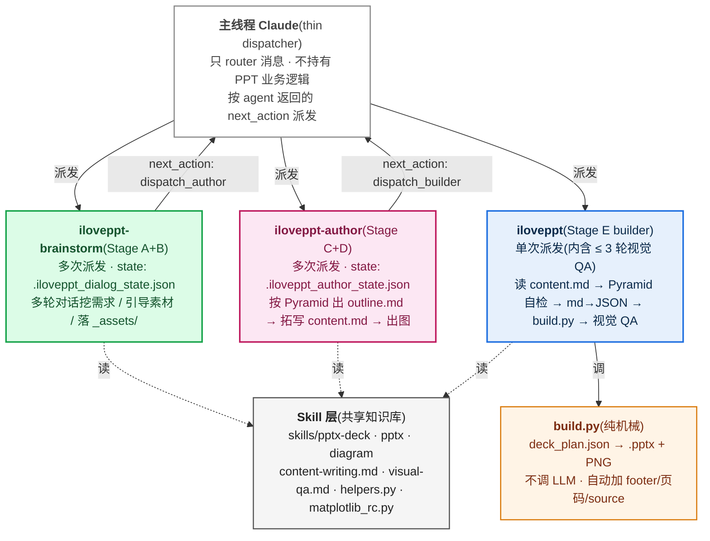
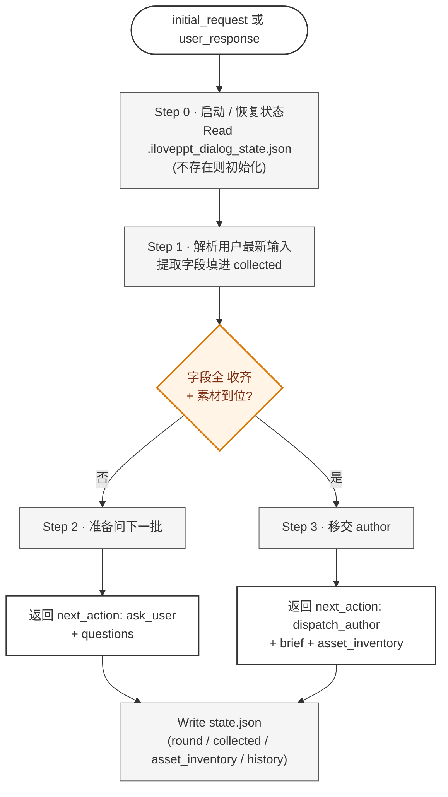
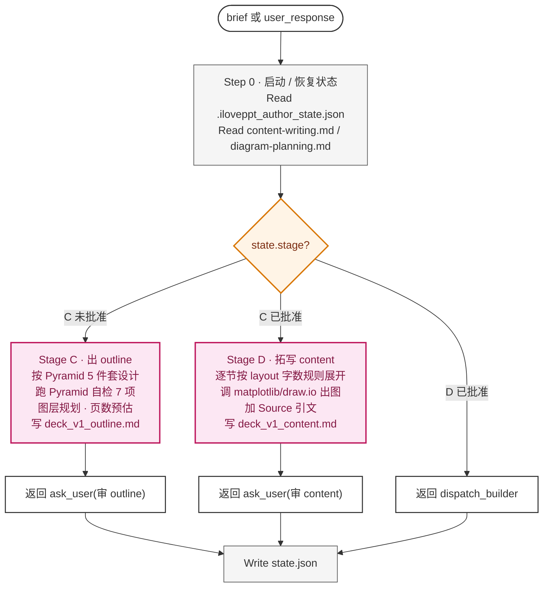
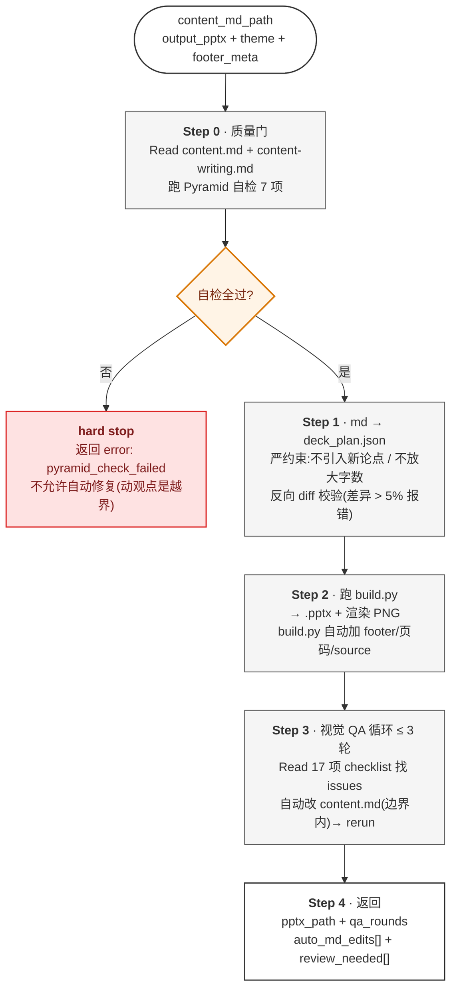
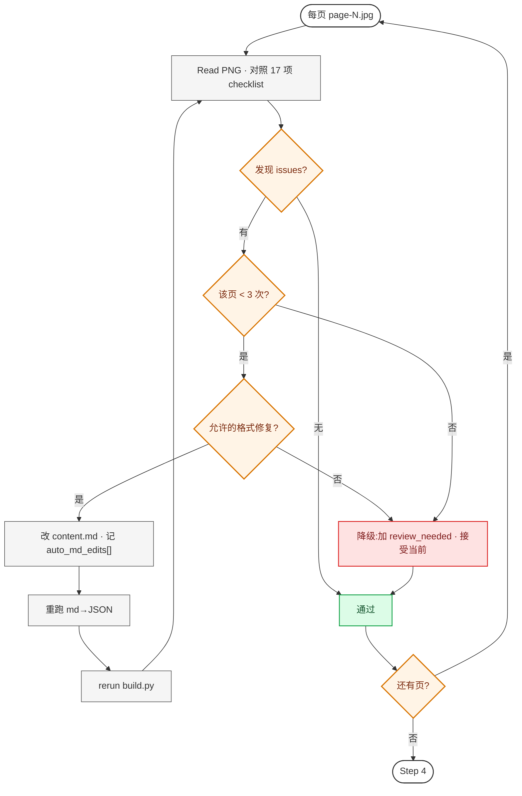
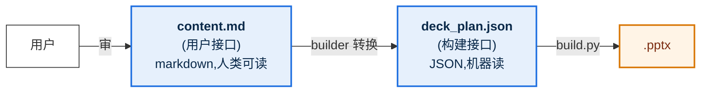

# iLovePPT Agent 工作原理(v3.1)

> 这份文档讲清楚 iLovePPT **怎么工作的** —— 系统架构、3 agent 接力、多轮派发机制、关键设计决策。
> 适合想理解或改造系统的人;不是用户操作手册(那个看 [`MANUAL.zh.md`](MANUAL.zh.md))。
>
> *版本:v3.1 · 2026-05-23 · 取代 v2 端到端 agent 设计*
> *v2 spec 历史保留:[v2 agent design](superpowers/specs/2026-05-23-iloveppt-agent-design.md)*
> *v3.1 spec(权威):[v3 markdown-first](superpowers/specs/2026-05-23-iloveppt-v3-markdown-first.md)*

---

## 目录

- [1. 30 秒理解](#1-30-秒理解)
- [2. 核心架构:主线程 + 3 agent + skill + build.py](#2-核心架构主线程--3-agent--skill--buildpy)
- [3. 三个 agent 各自的角色](#3-三个-agent-各自的角色)
  - [3.1 iloveppt-brainstorm(Stage A+B)](#31-iloveppt-brainstormstage-ab)
  - [3.2 iloveppt-author(Stage C+D)](#32-iloveppt-authorstage-cd)
  - [3.3 iloveppt(Stage E builder)](#33-iloveppt-stage-e-builder)
- [4. 关键机制](#4-关键机制)
  - [4.1 多次派发 + state file](#41-多次派发--state-file)
  - [4.2 next_action 路由协议](#42-next_action-路由协议)
  - [4.3 双接缝:content.md + deck_plan.json](#43-双接缝contentmd--deck_planjson)
- [5. 接口契约](#5-接口契约)
- [6. 关键设计决策](#6-关键设计决策)
- [7. 一次完整调用的 timeline](#7-一次完整调用的-timeline)
- [8. 这套设计避开了哪些坑](#8-这套设计避开了哪些坑)
- [9. 进一步阅读](#9-进一步阅读)

---

## 1. 30 秒理解

iLovePPT 把"写 PPT"拆成 **3 个 Claude Code agent 接力**:

| Agent | 阶段 | 干什么 |
|---|---|---|
| `iloveppt-brainstorm` | Stage A + B | 多轮挖需求(audience / duration / 核心命题)+ 收素材(数据 / 图 / 模板) |
| `iloveppt-author` | Stage C + D | 按金字塔原理出 outline.md → 用户审 → 拓写 content.md(含调 matplotlib 出图)→ 用户审 |
| `iloveppt` | Stage E | 接 content.md → Pyramid 自检 → md→JSON → build.py 出 .pptx → 视觉 QA 循环 |

**主线程 Claude 是 thin dispatcher**:不持有 PPT 业务逻辑,只按 agent 返回的 `next_action` 派发下一个 agent 或转发消息给用户。

**两个用户 checkpoint**(outline.md 审 + content.md 审)+ **两个机器接缝**(content.md 用户接口 + deck_plan.json 构建接口)。所有视觉 / 字号 / 配色规范都在 SSOT(`skills/pptx/helpers.py` + `skills/diagram/matplotlib_rc.py`),agent 不重复定义。

---

## 2. 核心架构:主线程 + 3 agent + skill + build.py



**4 层比喻**:
- **主线程** 是"前台",接待用户、转发到对应的"工种"
- **3 个 agent** 是 3 个不同"工种"(需求经理 / 文案策划 / 排版工程师),各自独立工位
- **skill** 是"工种共享的施工手册 + 工具箱"
- **build.py** 是"按图纸切料的机械臂"

---

## 3. 三个 agent 各自的角色

### 3.1 iloveppt-brainstorm(Stage A+B)

**职责**:跟用户多轮对话,收齐 brief + 素材清单。



**必收齐字段**:`audience` / `duration_min` / `top_recommendation` / `theme` / `output`

**素材摄入触发**(对话中识别用户提到):
- 数据 / 报表 / 趋势 → 引导提供 CSV 路径或粘贴
- 现有架构图 / 流程图 → 引导提供 PNG 路径或说"现画"
- 公司模板 → 引导提供 .pptx 路径(走 template-extract)
- 参考报告 → 引导提供 PDF / md 路径

素材落到 `<working_dir>/_assets/{raw,refs}/`,加入 `asset_inventory`(类型 + 路径 + 描述 + summary)。

**不做**:不设计 outline / 不写文案 / 不出图 / 不调 build.py。

**详细 agent 文件**:`.claude/agents/iloveppt-brainstorm.md`

### 3.2 iloveppt-author(Stage C+D)

**职责**:基于 brief + 素材清单,按金字塔原理出 outline.md(Stage C)+ 拓写 content.md(Stage D),含调 matplotlib/draw.io 出图。



**金字塔原理 5 件套**(Stage C 必跑自检 7 项):
- ① 单一顶端论点(`top_recommendation`)
- ② SCQA 开场(Situation / Complication / Question / Answer)
- ③ 答案在前(BLUF — cover.subtitle 含顶端论点)
- ④ 横向 MECE(3-5 章节,两两不重叠)
- ⑤ 纵向疑问/回答链(章节标题串读能讲完整故事)
- ⑥ 字段完整性
- ⑦ action title ≤ 24 字

**接收用户改动**:用户可以直接编辑 outline.md / content.md 文件,也可以说"改第 3 节标题为 X"让 author 改。

**不做**:不收新素材(发现缺 → 返回 error 让主线程决定是否重派 brainstorm)/ 不写 deck_plan.json / 不跑 build.py / 不做视觉 QA。

**详细 agent 文件**:`.claude/agents/iloveppt-author.md`

### 3.3 iloveppt(Stage E builder)

**职责**:接收 author 已和用户协同确认过的 `deck_v1_content.md`,构建 `.pptx`。**单次派发完成,内部含 ≤ 3 轮视觉 QA 循环**。



**视觉 QA 循环细节**(builder Step 3):



**自动改 content.md 边界**(决策 8a — 允许 vs 禁止):

| ✅ 允许(纯格式) | ❌ 禁止(动观点/数据) |
|---|---|
| 缩短 action title(超 24 字) | 改 action title 立场 / 语义 |
| bullet 字数超限 → 截短 | 删整条 bullet / 改顺序 |
| 合并连续 bullet(超数量) | 改 source 引文 / 数据值 |
| 改 layout 注释(推断错) | 加删整张 slide / 改 frontmatter |
| 修 markdown 语法错 | |

**Cross-cutting concerns**(build.py 自动加,不是 builder agent 显式做):

```mermaid
flowchart TB
    F["make_<layout>(prs, **fields)<br/>theme 渲染完一页"] --> P1{slide 有 source?}
    P1 -->|是| SC["H.source_citation 渲染 Source: ... 在 footer 上方"]
    P1 -->|否| P2
    SC --> P2{layout 在 FOOTERED_LAYOUTS?<br/>(8 种内容页)}
    P2 -->|是| FT["H.footer 分隔线 + N/TOTAL + footer_meta 左侧"]
    P2 -->|否| END([本 slide 完成])
    FT --> END
    classDef io fill:#FFF,stroke:#333,stroke-width:1.5px
    classDef gate fill:#FFF4E6,stroke:#D97706,stroke-width:2px,color:#7C2D12
    classDef act fill:#E6F0FC,stroke:#1E6FE0,stroke-width:2px,color:#0B2A4A
    class F,END io
    class P1,P2 gate
    class SC,FT act
```

`source` / `footer_meta` 都从 deck_plan.json 透传,任何 layout 都可加。theme `make_*` 函数完全不感知。

**详细 agent 文件**:`.claude/agents/iloveppt.md`

---

## 4. 关键机制

### 4.1 多次派发 + state file

**问题**:subagent 是单次派发(派一次跑完返回),怎么实现多轮对话?

**答案**:**多次派发同一 agent**,每次启动时 Read 自己的 state file 恢复进度;返回前 Write state 把最新状态写盘。

```mermaid
sequenceDiagram
    actor U as 用户
    participant M as 主线程<br/>dispatcher
    participant A as agent<br/>(brainstorm)
    participant S as state.json

    M->>+A: dispatch(initial_request)
    A->>S: Read(不存在,初始化)
    Note over A: 解析 initial 提取部分字段<br/>问下一批
    A->>S: Write({round:1, collected:{...}})
    A-->>-M: ask_user(questions)
    M->>U: 转发问题
    U->>M: 答
    M->>+A: dispatch(user_response="...")
    A->>S: Read(载入 round 1 状态)
    Note over A: 解析答案补字段<br/>问下一批
    A->>S: Write({round:2, collected:{...更全}})
    A-->>-M: ask_user(questions)
    ...
    M->>+A: dispatch(user_response="...")
    A->>S: Read(全收齐)
    A-->>-M: dispatch_author(brief + assets)
```

**state file 位置**(在 `working_dir` 下):
- `.iloveppt_dialog_state.json` —— brainstorm 状态
- `.iloveppt_author_state.json` —— author 状态(stage / approvals / iteration)
- builder 无需 state file(单次派发完成)

**为什么这套机制 work**:
- agent 在新 context 中启动时,state file 是它的全部记忆来源
- 主线程不需要"记得"对话历史 —— 那是 agent 自己的事
- 跨 session / 跨用户 / 重启 Claude Code 都能恢复

### 4.2 next_action 路由协议

所有 agent 返回都遵守统一 schema,主线程按 `next_action` 路由:

```yaml
next_action: ask_user | dispatch_brainstorm | dispatch_author | dispatch_builder | done | error

# next_action == ask_user 时:
message_to_user: "<给用户的话>"
questions: [...] | "<开放问题>"

# next_action == dispatch_* 时:
dispatch:
  agent: iloveppt-brainstorm | iloveppt-author | iloveppt
  args: {...}

# next_action == done 时(只有 builder 出):
pptx_path: ...
auto_md_edits: [...]
review_needed: [...]

# next_action == error 时:
error: <error_code>
message: <人类可读>
```

主线程的伪代码:

```
loop:
  ret = dispatch(current_agent, current_args)
  switch ret.next_action:
    case "ask_user":
      show(ret.message_to_user + ret.questions)
      current_args.user_response = wait_for_user()
      # 同一个 agent 带新答案再派发
    case "dispatch_*":
      current_agent = ret.dispatch.agent
      current_args = ret.dispatch.args
    case "done":
      show(ret.pptx_path + ret.auto_md_edits + ret.review_needed)
      break
    case "error":
      show(ret.error + ret.message)
      break
```

主线程**零业务逻辑** —— 只是状态机的转发者。

### 4.3 双接缝:content.md + deck_plan.json



**为什么 2 个接缝**:
- `content.md` 服务**用户审阅 + 编辑**(markdown 人类友好,可在 VS Code / Obsidian 直接改)
- `deck_plan.json` 服务**机械构建**(structured,build.py 已测试覆盖,evals 守护)
- builder 做 md → JSON 转换时**严约束**:不引入新论点 + 反向 diff 校验(差异 > 5% 报错),保证 JSON 是 md 的事实快照

---

## 5. 接口契约

### 5.1 主线程 → agent 入参

```yaml
# 通用必填
working_dir: /abs/path/to/deck-工作目录       # 所有 state / 产物的根

# 多轮场景:用户对上一轮的响应
user_response: "用户答 或 '批准' / '改 X' 等"  # 可选

# brainstorm 初次派发
initial_request: "用户的一句话需求"

# author 初次派发(C 阶段)
stage: C | D
brief: {audience, duration_min, top_recommendation, theme, output}
asset_inventory: [...]

# builder 派发
content_md_path: /abs/path/to/deck_v1_content.md
output_pptx: /abs/path/to/deck_v1.pptx
theme: tech_blue                               # 或 .pptx 模板路径
footer_meta:                                    # 可选 deck 级
  classification: INTERNAL
  project: ...
  version: v1.0
```

### 5.2 state file schema

**`.iloveppt_dialog_state.json`** (brainstorm):
```json
{
  "agent": "iloveppt-brainstorm",
  "round": 3,
  "collected": {
    "audience": "technical",
    "duration_min": 15,
    "top_recommendation": "...",
    "theme": "tech_blue",
    "output": "./deck_v1.pptx"
  },
  "asset_inventory": [
    {"type": "csv", "path": "_assets/raw/q4.csv", "desc": "Q4 营收", "summary": "..."}
  ],
  "history": [
    {"q": "给谁看?", "a": "技术团队"},
    {"q": "多长?", "a": "15 分钟"}
  ],
  "status": "complete"
}
```

**`.iloveppt_author_state.json`** (author):
```json
{
  "agent": "iloveppt-author",
  "stage": "D",
  "outline_md_path": "deck_v1_outline.md",
  "content_md_path": "deck_v1_content.md",
  "approvals": {"outline": true, "content": false},
  "iteration": 2,
  "user_revisions_received": [
    "第 3 节标题改成 ...",
    "加一节关于 ... 在第 5 后"
  ]
}
```

### 5.3 markdown schema

完整 schema 在 [`content-writing.md` v3 markdown schema 章节](../skills/pptx-deck/content-writing.md#-v3-markdown-schema主线程--agent-接口契约)。摘要:

**outline.md**:frontmatter(brief 全字段 + footer_meta + scqa + top_recommendation)+ `# Outline` 下每章 `## N. <action title>` + 末尾 `# Pyramid 自检` checkbox 列表。

**content.md**:frontmatter(继承 outline)+ `# Content` 下每页:
- `## [cover]` / `## [toc]` / `## [section_divider]` / `## [summary]` / `## [closing]` —— 特殊 layout
- `## N. <action title>` —— 内容页,后跟 `<!-- layout: X -->` 注释 + 内容
- `` —— 嵌入图
- `> 数据:Source: ...` —— 数据引文

**deck_plan.json**(builder 产出,内部用,不暴露给用户):见 `content-writing.md` "deck_plan.json schema" 章节。

### 5.4 工作目录布局

```
<working_dir>/
├── deck_v1_outline.md            # author Stage C 产出
├── deck_v1_content.md            # author Stage D 产出
├── deck_plan.json                # builder 内部产物
├── deck_v1.pptx                  # 最终产物
├── deck_v1_render/               # 渲染图(QA 用,.gitignore'd)
├── .iloveppt_dialog_state.json   # brainstorm 状态
├── .iloveppt_author_state.json   # author 状态
└── _assets/
    ├── raw/                      # 用户提供的原始素材
    ├── charts/                   # matplotlib / draw.io 生成的图
    └── refs/                     # 用户直接给的参考图
```

---

## 6. 关键设计决策

### 6.1 build.py 是"纯机械",不调 LLM

**最重要的接缝约束。**

```
┌──────────┐   deck_plan.json   ┌──────────┐
│ builder  │ ─────────────────→ │ build.py │
│ (LLM 推) │   纯数据,无歧义     │ (机械)   │
└──────────┘                    └──────────┘
```

- **可重放**:任何人拿着 `deck_plan.json` 跑 `python3 build.py` 都出一模一样的 .pptx
- **可调试**:出问题先看 JSON —— 是 builder 转错,还是 build.py 渲染错?一目了然
- **可测试**:`evals/run_eval.sh` 跑固定 plan,验证 build.py 没回归,不掺 LLM 不确定性

如果 build.py 内嵌 LLM 调用,这 3 条全废。

### 6.2 markdown 是用户接口,而非 yaml

v2 用 yaml 做用户审核接口,**用户看不懂**(`mece_check_passed: true` 是黑话)。v3 改用 markdown:

| 维度 | v2 yaml | v3 markdown |
|---|---|---|
| 用户可读性 | 差(技术语言) | 强(自然文档) |
| 编辑工具 | 必须文本编辑器谨慎改 | 任何 markdown editor / Obsidian / VS Code |
| 版本对比 | git diff 难读 | git diff 易读 |
| 多人协作 | 容易冲突 | markdown merge 友好 |
| 用户审什么 | 框架(120 字) | 完整文案(2000-5000 字)+ 嵌入图 |

### 6.3 3 agent 拆分而非 1 个端到端

**v3 spec 初稿曾错误归因**:把"无法多轮对话"归到"subagent 是单次派发",提出"全部搬主线程"。

实际上 subagent **完全可以多轮** —— 通过"多次派发 + state file"(v2 的 Phase 1 → 审 → Phase 2 已经是 2 次派发,扩到 N 次没问题)。

3 agent 拆分的真实理由:

| 维度 | 1 个端到端 agent | 3 agent 拆分 |
|---|---|---|
| 角色聚焦 | agent 同时做对话 + 设计 + 构建,prompt 庞杂 | 每 agent 一段窄角色,prompt 干净 |
| Test / Debug | 出问题难定位是哪一步坏 | 每 agent 独立 test,失败定位准 |
| 复用性 | 想单独跑"出 outline"做不到 | 可以单独 `@agent iloveppt-author` 跳过对话 |
| 上下文压力 | agent 后期累积大量 Read | 每 agent 独立 context,各自清爽 |

### 6.4 主线程退化为 thin dispatcher

主线程**不持有任何 PPT 业务逻辑** —— 它只是 next_action 状态机的转发者。

**为什么**:
- 主线程是用户的"通用 chat 伙伴",不应被 PPT 任务污染(用户可能同时跟主线程聊代码、聊调试)
- 业务逻辑放主线程 → 不可移植(每个 session 重新发现);放 agent → 可发现可移植(`@agent` 触发)
- 主线程上下文限额宝贵,不要塞 30K tokens 的 outline / content

### 6.5 SSOT —— 代码层一份定义,不重复

颜色 / 字体 / 尺寸只在 `skills/pptx/helpers.py`:

```python
BRAND_PRIMARY = RGBColor(0x0A, 0x52, 0xBF)   # AAA 7.00:1 对比度
ACCENT        = RGBColor(0x00, 0x7A, 0x6D)   # AA 5.2:1
FONT_CN       = "Microsoft YaHei"            # 系统兼容默认
FONT_CN_DESIGN= "Source Han Sans CN"         # 设计感更强(opt-in)
SLIDE_W       = Inches(13.333)
FOOTER_TOP    = Inches(7.0)
```

所有 theme / build.py / 测试都引用这些常量,**不复制**。改一处全 deck 联动。

**两条独立 SSOT 链**:
- `helpers.py` —— `.pptx` 渲染域(python-pptx)
- `skills/diagram/matplotlib_rc.py` —— matplotlib 数据图域(从 `helpers.py` 抄录 hex 字符串)

matplotlib 用 `font.sans-serif` 列表 / hex 字符串,与 python-pptx 的 `RGBColor` / `<a:ea typeface>` 类型不兼容,无法直接共享对象,所以拆。改 helpers.py 后需手动同步(grep `_hex(H.` 找 mirror 点)。

### 6.6 视觉规范全面对标 BCG/McKinsey

2026-05-23 对标行业最佳实践后,17 项调整全部落地(v3 / v3.1 都完全保留):

| 调整 | 旧 → 新 | 依据 |
|---|---|---|
| body 字号 | 14pt → 18pt | BCG/Beautiful.ai 最低投影标准 |
| 页标题 | 28pt → 32pt | MBB action title 标准 |
| BRAND_PRIMARY | `#1E6FE0`(AA) → `#0A52BF`(AAA 7:1) | WebAIM 投影建议 |
| Source 引文 | 无 → 自动加在 footer 上方 | MBB 数据 slide 硬要求 |
| Cover 元数据 | 无 → prepared_by/date/version/project_code/classification | 咨询稿标准 |
| Closing 结构 | "谢谢" → 可选 next_steps 列表 | closing = call to action |
| Footer 左侧 | 仅 page num → +classification·project·version | MBB 标准 footer |
| matplotlib 风格 | default → matplotlib_rc SSOT | 防 chart 与 deck 视觉割裂 |
| action title | 无字数上限 → ≤ 24 字硬约束 | 防换行破布局 |
| 12-col grid | 无 → `grid_columns()` 锚定 | 防跨页对不齐 |
| 视觉 QA | 12 项 → 17 项 | + 留白 / 热区 / 主色比例 / 跨页一致 |

详细规范见 `skills/pptx-deck/visual-qa.md`。

### 6.7 视觉 QA 由 Claude 做,不是 Python 脚本

视觉问题(文字溢出、字体 fallback、留白失衡、对比度)用 Python 规则识别**极其脆弱**;Claude 多模态读 PNG 直接判断又快又准。

builder Stage E Step 3 的循环逻辑:`Read PNG → 找 issue → 改 content.md → rerun → 再 Read`。**3 轮上限是反死循环兜底** —— 3 轮还修不好多半是 layout 选错(改字号 / 位置救不了),降级让人审。

---

## 7. 一次完整调用的 timeline

假设你说:`帮我做一份"评审办法 v1.0"的 PPT,15 分钟,技术受众`

```
=== Stage A · brainstorm 派发 #1 ===
T+0s     主线程派发 iloveppt-brainstorm(initial_request=用户的一句话)
T+5s     agent: Read state(不存在,初始化)
         解析"15 分钟 / 技术受众" → collected={audience: technical, duration_min: 15}
         缺 top_recommendation / theme / output / 素材
T+10s    agent: Write state(round=1)
         返回 ask_user(顶端论点是什么?用 tech_blue?有数据吗?)
T+10s    主线程展示问题

─── 用户答:"想说本季度落地办法 5 阶段 ≤3 天 / tech_blue / 有 q4.csv" ───

=== Stage A · brainstorm 派发 #2 ===
T+1min   主线程派发 iloveppt-brainstorm(user_response="...")
T+1.1m   agent: Read state(round=1 状态)
         解析答案 → collected 全收齐
         Read q4.csv 验证 → 加入 asset_inventory
T+1.5m   agent: Write state(round=2, status=complete)
         返回 dispatch_author(带 brief + asset_inventory)

=== Stage C · author 派发 #1 ===
T+1.5m   主线程派发 iloveppt-author(stage=C, brief, assets)
T+1.7m   agent: Read state(不存在,初始化)
         Read content-writing.md + diagram-planning.md
T+2.5m   agent 按 Pyramid 设计 outline + 跑自检 7 项
         写 deck_v1_outline.md
T+3min   agent: Write state(stage=C, approvals.outline=false)
         返回 ask_user(审 outline)

─── 用户改了第 3 节标题,回 "批准" ───

=== Stage D · author 派发 #2 ===
T+4min   主线程派发 iloveppt-author(user_response="批准")
T+4.1m   agent: Read state(stage=C, approvals.outline 改 true)
         转入 Stage D
         调 matplotlib 出 Q4 chart → _assets/charts/q4.png
T+6min   写 deck_v1_content.md(20 页 + 嵌入图)
T+6min   agent: Write state(stage=D, content_md_path=...)
         返回 ask_user(审 content)

─── 用户审,直接 edit content.md 第 5 页一个数字,回 "批准" ───

=== Stage E · builder 派发(单次) ===
T+10min  主线程派发 iloveppt(content_md_path)
T+10.5m  agent: Read content.md + Pyramid 自检 → 全过
T+11min  md → deck_plan.json
T+12min  跑 build.py → .pptx + 20 PNG(~60s)
T+13min  视觉 QA 第 1 轮:Read 20 PNG,发现 page 5 action title 超 24 字
T+13.5m  auto_md_edit: 缩短标题 → rebuild
T+14.5m  第 2 轮:全过
T+15min  返回 done(pptx + auto_md_edits[1 条])

T+15min  主线程展示成品 + 1 条自动改动报告
```

**总耗时**:~15 分钟。用户实际投入对话 ~5 分钟,其余是 agent 工作时间。

---

## 8. 这套设计避开了哪些坑

### 流程层

| 坑 | 防御 |
|---|---|
| 一口气跑完,大纲跑偏要等成品才发现 | 两个 markdown checkpoint(outline / content) |
| LLM 出 .pptx 不可重放、不可调试 | `deck_plan.json` 接缝,build.py 纯机械 |
| 大纲是话题堆叠没论证 | Pyramid 自检 7 项(author Stage C + builder Step 0 两层防御) |
| 全是文字 bullet 没图 | author Stage C 图层规划,4 类图决策表 |
| 视觉 fallback / 字体错 / 留白歪 | builder Stage E Step 3 视觉 QA × 3 轮 |
| 无限循环改不动 | 3 轮上限 + `review_needed` 降级 |
| 改一处颜色要改 10 个文件 | SSOT in `helpers.py` + `matplotlib_rc.py` |
| agent 一直跑成本失控 | subagent 隔离上下文 + 自带 ~95% compaction 兜底 |

### 视觉规范层(对标 BCG/McKinsey)

| 坑 | 防御 |
|---|---|
| body 11-14pt 在投影上看不清 | 默认 18pt,字数上限同步收紧 30% |
| 主色对比度不过 AAA,投影泛白 | `BRAND_PRIMARY = #0A52BF` (7:1),单元测试守护 |
| 数据 slide 不标 source | `source` 字段任何 layout 可加,build.py 自动渲染 |
| 内容页没页码 / 页脚 | build.py 自动加 footer + N/TOTAL(8 种 layout) |
| 机密文件缺 classification 徽标 | `footer_meta: {classification, project, version}` 每页 footer |
| 封面缺咨询元素 | `make_cover` 5 个可选 meta 字段 |
| 封底"谢谢"墙 | `make_closing.next_steps` 替代 |
| chart 风格与 deck 割裂 | `matplotlib_rc.apply_iloveppt_style()` SSOT |
| action title 太长换行破布局 | ≤ 24 字硬约束(author + builder 两层 check) |
| 跨页元素对不齐 | `grid_columns()` 12-col grid 锚定 |
| 单页视觉 QA 漏 deck-level 不一致 | 17 项 = 12 基础 + 5 进阶 + 3 deck-level |
| 主色泛滥(单页 60% BRAND_PRIMARY) | 60-30-10 视觉 QA 项 |

### 协同设计层

| 坑 | 防御 |
|---|---|
| 用户不会写 brief | `iloveppt-brainstorm` 多轮派发问到收齐 |
| 用户审 YAML 看不懂(盲批) | markdown 双 checkpoint(outline.md + content.md) |
| 数据图 / 用户已有图没入口 | brainstorm Stage B 显式引导,落 `_assets/{raw,refs}/` |
| 文案错字要等 .pptx 出来才发现 | author Stage D content.md 审过才进 builder |
| 手改 .pptx 后 agent 重跑覆盖 | 用户改 content.md,builder 永远从 md 派生 |
| 多版本管理乱 | `deck_v{N}_*.md` 显式版本号 |
| builder 改 md 用户不知道 | `auto_md_edits[]` 返回 + 主线程展示 |
| author 拓写引入用户没说的话 | md → JSON 严约束 + 反向 diff 校验 |
| 用户绕过流程直接 `@iloveppt` | builder 检查入参缺 content_md_path 直接 reject |
| 主线程被 PPT 任务污染 | 3 agent 拆分 + 主线程纯 dispatcher |

---

**一句话总结**:iLovePPT 把"写 PPT"拆成 **3 agent**(brainstorm / author / builder),**主线程退化为 thin dispatcher**(只 router 不持有业务逻辑)。多轮交互通过"**多次派发 + state file**"实现;两个用户 checkpoint(outline.md / content.md)+ 两个机器接缝(content.md / deck_plan.json)+ SSOT(helpers.py + matplotlib_rc.py)+ 17 项视觉规范 + Pyramid 自检 + md→JSON 严约束,共同防各种漂移。

---

## 9. 进一步阅读

| 想了解 | 看 |
|---|---|
| **v3.1 设计 spec(权威,8 决策 + 接口契约)** | `docs/superpowers/specs/2026-05-23-iloveppt-v3-markdown-first.md` |
| iloveppt-brainstorm 完整 prompt | `.claude/agents/iloveppt-brainstorm.md` |
| iloveppt-author 完整 prompt | `.claude/agents/iloveppt-author.md` |
| iloveppt(builder)完整 prompt | `.claude/agents/iloveppt.md` |
| v2 端到端 agent 历史设计(供对比) | `docs/superpowers/specs/2026-05-23-iloveppt-agent-design.md` |
| 5 阶段主流程 + dispatcher 协议 | `skills/pptx-deck/workflow.md` |
| markdown schema(outline.md + content.md) | `skills/pptx-deck/content-writing.md` |
| 金字塔原理 5 件套 + 自检 7 项 | `skills/pptx-deck/content-writing.md` |
| 图层规划 4 类决策表 | `skills/pptx-deck/diagram-planning.md` |
| 视觉自检 17 项 checklist | `skills/pptx-deck/visual-qa.md` |
| 模板提取(主色 + 字体) | `skills/pptx-deck/template-extract.md` |
| draw.io / Mermaid / matplotlib 出图 | `skills/diagram/SKILL.md` |
| matplotlib 风格 SSOT | `skills/diagram/matplotlib_rc.py` + `matplotlib.md` |
| 底层 .pptx 读写 + footer/source helper | `skills/pptx/SKILL.md` + `skills/pptx/helpers.py` |
| 12-col grid 原语 | `skills/pptx/layout.py: grid_columns()` |
| 设计 token(SSOT 源头) | `skills/pptx/helpers.py` |
| 仓库架构与代码约定 | `CLAUDE.md`(根目录) |
| 用户操作手册(v3.1 流程) | `docs/MANUAL.zh.md` |

---

*文档版本:3.1 · 2026-05-23 重写 · 反映 3-agent 流水线最终架构*
